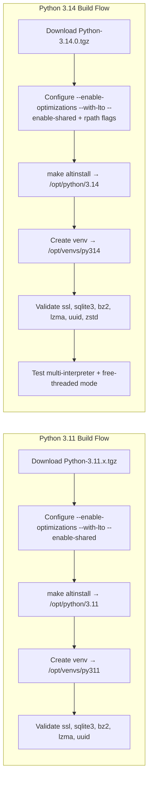

⚙️ Build Process Comparison
|  |  |  |  | 
|  | Development Toolsopenssl-develbzip2-devellibffi-develzlib-devel | uuid-devellibuuid-devel |  | 
|  | Python-3.11.x.tgz | Python-3.14.0.tgz |  | 
|  | --enable-optimizations --with-lto --enable-shared | CPPFLAGSLDFLAGS |  | 
|  | /opt/python/3.11 | /opt/python/3.14 |  | 
|  | make altinstall | make altinstall | python3 | 
|  | /opt/venvs/py311 | /opt/venvs/py314 |  | 
|  | sslsqlite3bz2lzma_uuid |  |  | 
|  | zstandardanyiotriouvloop |  |  | 

🚀 Key Differences in 3.14
- Concurrency: Multi-interpreter + free-threaded mode (true parallelism, safer isolation).
- Developer Experience: Syntax-colored errors, REPL highlighting, autocorrection suggestions.
- New Features: Template string literals (${var}), built-in Zstandard compression, asyncio task inspection.
- Isolation Impact: rpath handling is more important in 3.14 to ensure interpreters don’t bleed state.

🔒 Upgrade Path for Your Lab
- Keep both builds side by side (/opt/python/3.11 and /opt/python/3.14) for compatibility testing.
- Pin CI/CD jobs to specific interpreters via shebangs or PATH overlays.
- Test concurrency workflows (Terraform checks, orchestration agents) under 3.14 to validate free-threaded scaling.
- Cache wheels separately for each venv to avoid cross-version contamination.
- Document configure flags — 3.14’s rpath and shared lib handling are critical for reproducibility.

🔎 Key Visual Differences
- Python 3.11: Classic configure flags, isolated prefix, venv, validation of core modules.
- Python 3.14: Adds explicit rpath handling, validates new modules (like Zstandard), and introduces concurrency testing (multi-interpreter + free-threaded mode).
This diagram makes it clear: 3.14 builds on the same isolated scaffolding as 3.11, but adds concurrency and modern compression features.
👉 Do you want me to extend this into a workflow overlay that shows how Terraform checks, CI/CD pipelines, and monitoring agents map onto these interpreters/threads? That would tie the build process directly into your lab orchestration style.

