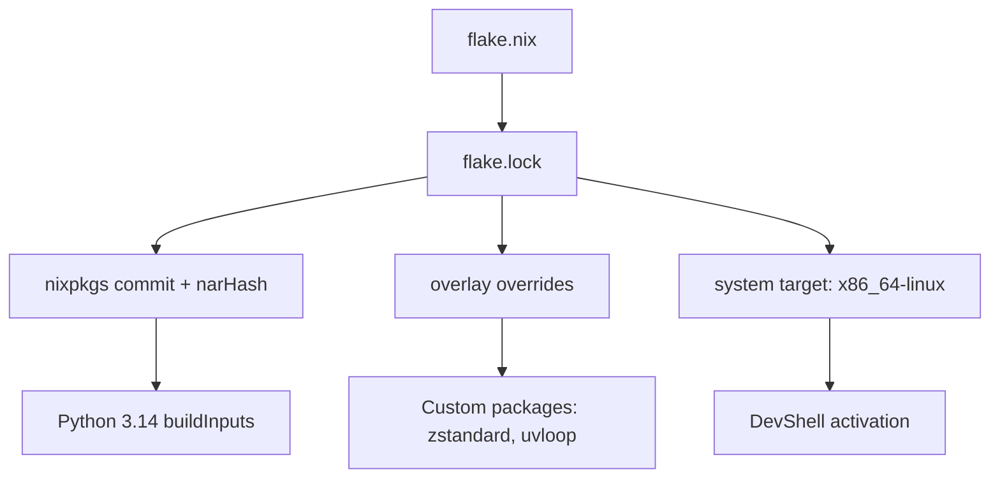

```
This flake is your fast lane to Python 3.14 — perfect for testing, CI bootstrapping, or scaffolding your lab’s next layer. Want me to scaffold a matching flake.lock visualizer or CI caching strategy next?

```



⚡️ CI/CD Caching Strategy
1. Prebuild the devShell
nix build .#devShells.x86_64-linux.default


This caches the entire shell closure so nix develop is instant.
2. Use nix-store --export for portability
Export the closure:
nix-store --export $(nix-store -qR result) > py314.nixpkg


Then import on CI runners:
nix-store --import < py314.nixpkg


3. Pin nixpkgs commit
Keep your flake.lock under version control. CI will always use the same narHash → reproducible builds.
4. Cache wheels inside venv
Inside your shell:
pip wheel -r requirements.txt -w /tmp/wheelhouse


Then reuse /tmp/wheelhouse across jobs.

🌀 Branding Angle
You could brand this caching layer as CACHEGUARD in your lab:
- Guardrails: pinned flake.lock narHashes
- Fast lanes: prebuilt devShells
- Artifacts: wheelhouse reuse

👉 Do you want me to scaffold a CI pipeline snippet (GitHub Actions style) that prebuilds and caches your Python 3.14 flake shell, so your lab jobs run instantly?
