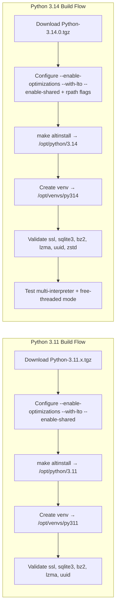

# Steps: NIX
Install Nix:
```
curl -L https://nixos.org/nix/install | sh
```
Create a flake.nix:
```
{
  description = "Python 3.14 dev shell";

  inputs.nixpkgs.url = "github:NixOS/nixpkgs/nixos-unstable";

  outputs = { self, nixpkgs }: let
    system = "x86_64-linux";
    pkgs = import nixpkgs { inherit system; };
  in {
    devShell.${system} = pkgs.mkShell {
      buildInputs = [
        pkgs.python314
        pkgs.python314Packages.virtualenv
        pkgs.zlib
        pkgs.openssl
        pkgs.libffi
      ];
    };
  };
}

```

Enter the shell:
```
nix develop
```

==========

# Steps: CONDA
Install Miniconda:
```
curl -LO https://repo.anaconda.com/miniconda/Miniconda3-latest-Linux-x86_64.sh
bash Miniconda3-latest-Linux-x86_64.sh
```

Create a Python 3.14 environment:
```
conda create -n py314 python=3.14
conda activate py314
```

Install extras:
```
conda install zstandard uvloop rich
```


## does nix-python behave different from regular python
🧊 How Nix Python Differs
- Reproducibility
- Nix pins exact versions of Python and all its dependencies (OpenSSL, zlib, libffi, etc.).
- Regular Python builds (system packages, source, Conda) can drift depending on what’s installed on the host.
- With Nix, if you declare python314 in a flake, every developer and CI runner gets the same binary and linked libraries.
- Isolation
- Nix installs Python into its own store path (/nix/store/...) rather than /usr/bin or /opt.
- This avoids conflicts with system Python and makes multiple versions coexist cleanly.
- Regular Python often requires manual prefixing (/opt/python/3.14) or virtualenvs to avoid collisions.
- Dependency Management
- Nix treats Python packages as derivations: each wheel or source build is reproducible and cached.
- Regular Python relies on pip/venv, which can vary depending on network state or PyPI changes.
- Environment Activation
- Nix shells (nix develop) inject Python into your PATH with all declared dependencies.
- Regular Python uses venv or Conda activate scripts to adjust PATH and environment variables.

🚀 Runtime Behavior
- Interpreter: Once inside a Nix shell, python3.14 behaves identically to a source‑built Python 3.14 — same syntax, same stdlib, same REPL.
- Modules: The difference is in where modules are loaded from (Nix store vs site‑packages).
- Performance: No runtime penalty — Nix doesn’t change CPython internals, just how it’s built and distributed.
- Compatibility: Scripts and apps don’t care whether Python came from Nix or a tarball, as long as the version matches.

🔑 When to Use Nix Python
- You want reproducibility across machines (CI/CD, dev labs, onboarding).
- You need multiple Python versions side by side without conflicts.
- You want declarative builds that can be version‑controlled and cached.
If you just need a quick isolated interpreter, a source build or Conda is fine. But for your modular lab scaffolding, Nix Python fits beautifully because it aligns with your blueprint‑driven, reproducible style.





